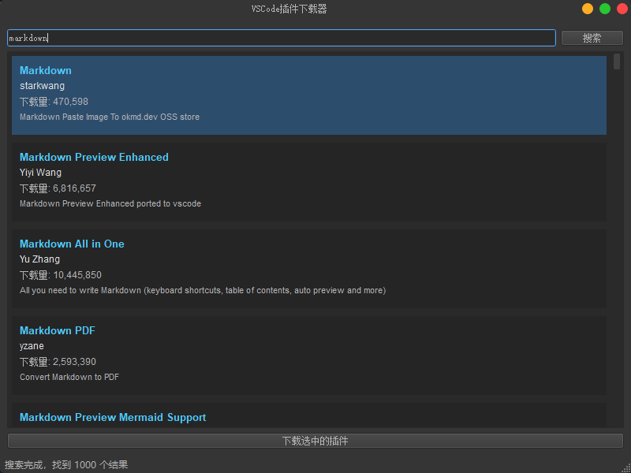

# 为方便下载某些VSCode插件做的一个简单的VSCode插件下载器

一个很简单的工具，用于从VSCode插件市场搜索和下载 Visual Studio Code 的插件(.vsix文件)，以便在其他地方离线安装使用。

## 界面

 

## 功能特点

- 搜索Visual Studio Code插件市场中的插件
- 显示插件详细信息，包括名称、发布者、下载量和简短描述
- 一键下载选中的插件到本地

## 使用方法

1. 在搜索框中输入插件名称或关键词
2. 点击"搜索"按钮或按回车键开始搜索
3. 从搜索结果列表中选择一个插件
4. 点击"下载选中的插件"按钮
5. 插件将被下载到程序目录下的`downloads`文件夹中

## 技术实现

- 使用PyQt5构建用户界面
- 通过Visual Studio Marketplace API获取插件信息

## 环境要求

- Python 3.6+
- PyQt5

## 安装依赖

```bash
pip install PyQt5 requests
```

## 运行方法

```bash
python main.py
```